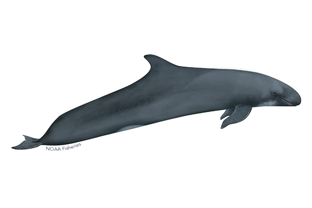

<!-- README.md is generated from README.Rmd. Please edit that file -->

```{r, include = FALSE}
knitr::opts_chunk$set(
  collapse = TRUE,
  comment = "#>"
)
library(fontawesome)
```

## Longline Acoustic Monitoring Project (LLAMP) Hub

`r fa(name = "calendar-check")` *Last Update: `r format(Sys.Date(), "%d %b %Y")`*

This site serves as the central 'hub' for all protocols related to the Longline Acoustic Monitoring Project (LLAMP). It is hosted on GitHub pages to enable easy access to our team when working from home or in the lab. This contains limited information (so some links may be broken) related to LLAMP to keep protected information out of this public repository. Additional analyses and info can be found in the main, private [llamp](https://github.com/sfregosi/llamp-hub) repository. Contact S. Fregosi to request access to that repository. 

The best link to bookmark is:
[github.com/sfregosi/llamp-hub](https://github.com/sfregosi/llamp-hub)



---

#### Disclaimer

<sub>The scientific results and conclusions, as well as any views or opinions expressed herein, are those of the author(s) and do not necessarily reflect the views of NOAA or the Department of Commerce.</sub>

<sub> This repository is a scientific product and is not official communication of the National Oceanic and Atmospheric Administration, or the United States Department of Commerce. All NOAA GitHub project code is provided on an 'as is' basis and the user assumes responsibility for its use. Any claims against the Department of Commerce or Department of Commerce bureaus stemming from the use of this GitHub project will be governed by all applicable Federal law. Any reference to specific commercial products, processes, or services by service mark, trademark, manufacturer, or otherwise, does not constitute or imply their endorsement, recommendation or favoring by the Department of Commerce. The Department of Commerce seal and logo, or the seal and logo of a DOC bureau, shall not be used in any manner to imply endorsement of any commercial product or activity by DOC or the United States Government.
</sub>
