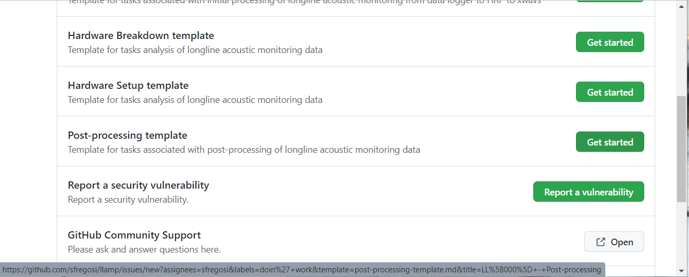

```{r setup, include=FALSE, message=FALSE, warning=FALSE,}
knitr::opts_chunk$set(echo = FALSE)
knitr::opts_chunk$set(fig.align = 'center')

library(fontawesome)
library(xaringanExtra)
library(htmltools)
```

```{r, xaringanExtra-clipboard, echo=FALSE}
htmltools::tagList(
  xaringanExtra::use_clipboard(
    button_text = "<i class=\"fa fa-clone fa-2x\" style=\"color: #301e64\"></i>",
    success_text = "<i class=\"fa fa-check fa-2x\" style=\"color: #90BE6D\"></i>",
    error_text = "<i class=\"fa fa-times fa-2x\" style=\"color: #F94144\"></i>"
  ),
  rmarkdown::html_dependency_font_awesome()
)
```

# Post-processing

First there is a set of tasks that are sort of post-processing/pre-analysis - where data are checked and metadata updated. 

#### Create GitHub issue

Use one of the two methods below to create a new post-processing issue for the latest trip, and add it to the [Longline Acoustic Monitoring GitHub Project](https://github.com/users/sfregosi/projects/3).

**Create issue from a template:**

1. Navigate to the [llamp](https://github.com/sfregosi/llamp) repository's [New Issue](https://github.com/sfregosi/llamp/issues/new/choose) page and press the green 'Get Started' button for the **Post-processing template**


```{r ss-ghi, echo = FALSE, out.width = '65%', fig.align = 'center', fig.cap = 'Screenshot showing the new issue chooser on GitHub'}

```

<!--  -->

**OR, Create issue manually using a 'blank' issue:**

2. Copy the below [text](https://github.com/sfregosi/llamp/blob/main/docs/files/post-processing_checklist.txt) into the body of a [new, blank issue](https://github.com/sfregosi/llamp/issues/new) and it will be formatted and ready to go in markdown syntax. **Name the issue 'LL0## - Post-processing'**


```{verbatim}
Detailed instructions for all below steps can be found in the [Analysis Protocol](https://github.com/sfregosi/llamp/blob/main/docs/_site/analysis.html)

**Metadata and data checks:**
- [ ] Add trip to the **phase_3_multi_deployments_summary.xslx** as an entry on the 'DataSummary_UW', 'DataSummary_IA', 'Depredation', and 'ProcessingStatus' tabs 
- [ ] Create **README_LL0##.txt** in 'LL0##' server folder. Update as working through the below steps
- [ ] Check datasheets for readability, combine photos if needed, and save as **LL0##\_observer_sheets_photos.pdf**
- [ ] Transcribe in-air and underwater data sheets to the appropriate tabs in a **LL0##\_summary.xlsx**; use blank template [LL000_Summary_phase3template.xlsx](https://github.com/sfregosi/llamp/blob/main/docs/files/LL000_Summmary_phase3template.xlsx)
- [ ] Manually review underwater data LTSA to check data quality and report data quality on the 'DataSummary_UW' tab of **phase_3_multi_deployments_summary.xslx**
- [ ]  During quality check, mark actual recorder in/out times from the acoustic record on 'RecorderTimes' tabs of **LL0##\_summary.xlsx**
- [ ] Check in-air data quality and report on the 'DataSummary_IA' tab of **phase_3_multi_deployments_summary.xslx**

**Run `workflow_processTrip.m` to complete below steps:**
- [ ] Convert log .xlsx to .mat (section `(1)`)
- [ ] Check logged and transcribed location data by plotting using `plotSetDrifts.m` (`workflow_processTrip.m` section `(1)`)
- [ ] Update **recorderKey.mat** (section `(2)`)
- [ ] Summarize deployment durations (section `(3)`)
- [ ] Compare logged times to recorder times in `durTable` and `l` (log).  Note any inconsistencies in the **README**
- [ ] Split xwavs if needed (section `(4)`)

**After `workflow_processTrip`:**
- [ ] If xwavs were split, remake 5 sec/100 Hz resolution LTSAs
- [ ] Make 2s/10 Hz resolution LTSAs for noise analysis
- [ ] Finalize 'README' and **phase_3_multi_deployments_summary.xslx**
```

## Detailed data-checking instructions 
[moving this here from processing steps!]

### Metadata and data checks
- Add trip to `phase_3_multi_deployments_summary.xlsx` on 5 tabs
  - **DataSummary_UW:** add 5 rows following format of previous trips with trip number in column A, vessel name and frame/datalogger numbers in column B, and the date for each deployed set (1 up to 8) in columns C to J). Note any problems or inconsistencies for each recorder in the 'notes' column
  - **DataSummary_IA:** added 7 rows, copying the 'Status' and 'Location' column values from an earlier trip
  - **Depredation:** provide a summary of the trip dates and Y or N for depredation with notes on specifically which sets, if any, had bait or catch depredation
  - **ProcessingStatus:** add a row for each recorder deployed and use this track steps as they are completed for each recorder + any notes on issues
  - **AnalysisStatus:** add a row for each recorder and track analysis steps (below) here
  - **Bouts:** not used for now. Current data is from Phase I and II analyses and is just left there as a placeholder
- Create `README_LL0##.txt` file on server (`//PICQUEENFISH/PSD2/CRP/LLHARP`) within the folder for this trip. This README will house any notes about data issues/trip inconsistencies while working through post-processing and analysis steps
- Check observer datasheets for readability and combine if needed (if photographed rather than scanned)
  - In Adobe Acrobat Pro: *File > Create > Combine Files into a Single PDF...*
  - Drag or select all photo files
  - Use the *Scan & OCR* tools to 'Enhance' each page
    - After selecting *Scan & OCR* on the right hand tools menu, click *Enhance > Camera Image* from the top tools menu
    - Page borders will appear. Adjust the extent of the page borders to include the whole page and exclude any background and click *Enhance Page* 
    - The default enhance level usually obscures some of the entries so reduce the enhancement level using the *Adjust enhancement level* slider until it is readable
    - Click on the next thumbnail to repeat for the next page
  - Save within the trip's server folder with the filename `LL0##_observer_sheets_photos.pdf`
- Transcribe underwater and in-air datasheets to .xlsx
  - Use the blank template found on SF's local machine at `C:\Users\Selene.Fregosi\Documents\longline_local\tripExcelSummaries\`
  `LL000_Summary_phase3_template.xlsx` or in the llamp repository at [LL000_Summary_phase3template.xlsx](https://github.com/sfregosi/llamp/blob/main/docs/files/LL000_Summmary_phase3template.xlsx)
  - Save the template as `LL0##_Summary.xlsx` within this trip's server folder
  - Fill in observer noted set/haul/recorder deployment times in the **Summary** tab
  - Fill in observer noted in-air recording times and filenames in the **In-air** tab
  - Updated the 4 **RecorderTimes_FR##** tabs with the correct frame numbers
- Review underwater data LTSA in Triton
  - Mark actual recorder in/out times from the acoustics and record the in/out times in the **RecorderTimes** tab(s) of `LL0##_summary.xlsx` created above
    - Use one tab per recorder/LTSA
    - Recordings are in UTC, so note in/out times in UTC and subtract 10 hours to also convert to local time for comparison to observer noted times
  - Note data availability and quality in the **DataSummary_UW** tab of `phase_3_multi_deployments_summary.xlsx`
    - Fill green for audio, red for no audio
    - Note the recorder deployment order (1-4) for each set
    - Make comments for any irregularities found such as noise, on deck recordings (recorder did not automatically turn off after recovery), data gaps, etc.
    - Report any problems with noise or missing data to the LLHARP hardware manager (likely Erik Norris)
- Review in-air data in Raven (or other?)
  - Load all files for a single recorder (e.g. Z03 or Z04) by selecting all files and dragging into the Raven window
  - Select *Page files* and set page length to 120 or 180 seconds
    - Each file is separated by a green dashed line; can move through files with black arrow at top right or by selecting the file number from the dropdown
  - Confirm file numbers, durations, and voice comments align with what is on the datasheet and transcribed to `L0##_summary.xlsx`
  - Note data availability and quality in the **DataSummary_IA** tab of `phase_3_multi_deployments_summary.xlsx`
    - Fill green for audio, red for no audio
    - Specify the file number for each set and recording sample
    - Note any irregularities such as missing data or incorrect timing

<sub>[Back to top](#)</sub>

### Process trip 

Run `workflow_processTrip.m` to work through converting the summary docs to .mat, running some log checks, and splitting up .xwavs that span multiple sets. 

- Set trip information in top section (unnumbered) of `workflow_processTrip.m`
  - Trip number `trip = ` on line 41
  - Frames to process (default is `frToProcess = 'all';` on line 43
  - Paths on lines 46 to 62
- Run section `(1)` to convert `LL0##_Summary.xlsx` times and locations to a .mat file
  - Check for timing inconsistencies as prompted
  - Check any location inconsistencies from the generated plot
  - Note any issues and try to fix discrepancies where possible, noting these issues or corrections in the **README**
- Run section `(2)` to manually enter the frame and datalogger numbers when prompted
  - The format should be `FR##_DL##` (e.g., `FR04_DL64`)
  - Hit *Enter* after each entry, and *Enter* again after all are entered to exit input state
- Run section `(3)` to summarize the recording durations, from the observer noted times and the acoustic record
  - Manually check durations for any large discrepancies between the acoustic record and observer log
  - If corrections are needed, make these corrections and note them in the **README**
- Run section `(4)` to work through the xwavs that span across sets and split the files as needed to preserve recording timing information for later analysis
  - This section will `pause` after calculating the number of file gaps. Manually compare this number to the observations in the manually marked recorder in/out times and if they match, hit *Enter* to continue
  - This section will take some time and will save 'original' xwavs before writing new, split xwavs
  - Update the **README** with info on the number of original xwavs, gaps, and deck test or on deck recordings and any other relevent notes
- Optional, run section `(5)` to plot the drifts again and TDR data, for reporting purposes. **_Section 5 is under development_**
  
<sub>[Back to top](#)</sub>
  
### Final checks

After `workflow_processTrip.m`, finalize the created ltsas and summary docs. 

- If xwavs were split, remake the LTSA in Triton
  - Use a 5 sec/100 Hz resolution for odontocete analysis
  - Name the LTSA `LL0##_FR##_DL##_5s_100Hz_splitFiles.ltsa` and save within the xwavs folder
- Make a finer resolution LTSA for noise analysis
  - Use a 2 sec/10 Hz resolution
  - Name the file `LL0##_FR##_DL##_2s_10Hz.ltsa` and save within the xwavs folder
- Finalize the **README** and `phase_3_multi_deployments_summary.xslx` by ensuring all inconsitencies are noted, and data checks completed, and all processing steps are done

<sub>[Back to top](#)</sub>

---

# Acoustic analyses

#### Create GitHub issue

Use one of the two methods below to create a new post-processing issue for the latest trip, and add it to the [Longline Acoustic Monitoring GitHub Project](https://github.com/users/sfregosi/projects/3).

**Create issue from a template:**

1. Navigate to the [llamp](https://github.com/sfregosi/llamp) repository's [New Issue](https://github.com/sfregosi/llamp/issues/new/choose) page and press the green 'Get Started' button for the **Analysis template**


```{r ss-ghi, echo = FALSE, out.width = '65%', fig.align = 'center', fig.cap = 'Screenshot showing the new issue chooser on GitHub'}

```

## Odontocetes

- Manually scan LTSAs to define start/end time of odontocete acoustic events 
  - in Triton
  - note potential species ID as possible
  - Either omit or separately log sperm whale events 
- Run Pamguard detector suite - click, whistle, burst pulse
  - use `PAM2016_LLHARP_BANTER.psfx` 
  - *For speed, the detectors can be run only over files with known odontocete events by hand selecting just the files of interest*
- Extract features of click, whistle, and burst pulse detections in `PAMpal` 
  - List the code here...
- Use `banter` to predict species label
  - Specify the model and code scripts here

## Noise
- Run Pamguard detector using `PAM2016_LLHARP_noise.psfx`
- Manually scan LTSAs to define start/end time of gear noise
- Run TOL noise detectors (option to use SanctSound metrics or PG noise module) 
- Update list of vessels with gear noise detected

## In-Air

Under development
- Review Zoom recordings to characterize sound


<sub>[Back to top](#)</sub>

---

# Past protocols

[LLHARP Part III - Data Analysis](https://docs.google.com/document/d/0BxY-_FjiYpOqUVpMMklhc21zenc/edit?resourcekey=0-t6GUsqDw3FRYaAj9if6_pQ) Google Doc  
*Last updated 24 March 2017*  
  - Manual scanning of LTSAs in Triton to find bouts, whistle classification using Raven to generate manual whistle picks plus ROCCA to trace and classify, and click detection and classification using a a set of Matlab tools (appears to be Triton-based but not sure on specific versions)
  - This is the approach used in Bayless et al. 2017

<sub>[Back to top](#)</sub>


## Last updated {.appendix}

`r fa(name = "calendar-check")` `r format(Sys.Date(), "%d %B %Y")`
