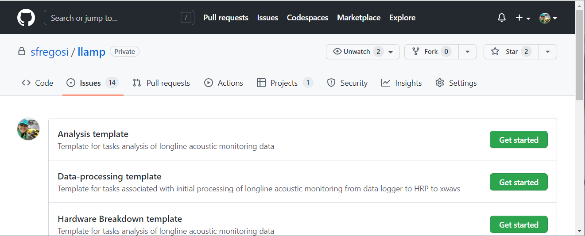

```{r setup, include=FALSE, message=FALSE, warning=FALSE,}
knitr::opts_chunk$set(echo = FALSE)
knitr::opts_chunk$set(fig.align = 'center')

library(fontawesome)
library(xaringanExtra)
library(htmltools)
```

```{r, xaringanExtra-clipboard, echo=FALSE}
htmltools::tagList(
  xaringanExtra::use_clipboard(
    button_text = "<i class=\"fa fa-clone fa-2x\" style=\"color: #301e64\"></i>",
    success_text = "<i class=\"fa fa-check fa-2x\" style=\"color: #90BE6D\"></i>",
    error_text = "<i class=\"fa fa-times fa-2x\" style=\"color: #F94144\"></i>"
  ),
  rmarkdown::html_dependency_font_awesome()
)
```

# Post-processing

First there is a set of tasks that are sort of post-processing/pre-analysis - where data are checked and metadata updated. 

#### Create GitHub issue

Create a new post-processing issue for the latest trip 

- Navigate to the [llamp](https://github.com/sfregosi/llamp){target='_blank'} repository's [New Issue](https://github.com/sfregosi/llamp/issues/new/choose){target='_blank'} page and press the green **Get Started** button for the **Post-processing template**
- Update the newly created issue name with the correct trip number, add any assignees, and add to the [Longline Acoustic Monitoring Project](https://github.com/users/sfregosi/projects/3){target='_blank'}

```{r ss-ghi-pp, echo = FALSE, out.width = '65%', fig.align = 'center', fig.link='images/screenshot_github_analysis-template.png', fig.cap = 'Screenshot showing the new issue template selection page on GitHub'}

```

## Metadata and data checks
- Add trip to `phase_3_multi_deployments_summary.xlsx` on 5 tabs
  - **DataSummary_UW:** add 5 rows following format of previous trips with trip number in column A, vessel name and frame/datalogger numbers in column B, and the date for each deployed set (1 up to 8) in columns C to J). Note any problems or inconsistencies for each recorder in the 'notes' column
  - **DataSummary_IA:** added 7 rows, copying the 'Status' and 'Location' column values from an earlier trip
  - **Depredation:** provide a summary of the trip dates and Y or N for depredation with notes on specifically which sets, if any, had bait or catch depredation
  - **ProcessingStatus:** add a row for each recorder deployed and use this track steps as they are completed for each recorder + any notes on issues
  - **AnalysisStatus:** add a row for each recorder and track analysis steps (below) here
  - **Bouts:** not used for now. Current data is from Phase I and II analyses and is just left there as a placeholder
- Create `README_LL0##.txt` file on server (`//PICQUEENFISH/PSD2/CRP/LLHARP`) within the folder for this trip. This README will house any notes about data issues/trip inconsistencies while working through post-processing and analysis steps
- Check observer datasheets for readability and combine if needed (if photographed rather than scanned)
  - In Adobe Acrobat Pro: *File > Create > Combine Files into a Single PDF...*
  - Drag or select all photo files
  - Use the *Scan & OCR* tools to 'Enhance' each page
    - After selecting *Scan & OCR* on the right hand tools menu, click *Enhance > Camera Image* from the top tools menu
    - Page borders will appear. Adjust the extent of the page borders to include the whole page and exclude any background and click *Enhance Page* 
    - The default enhance level usually obscures some of the entries so reduce the enhancement level using the *Adjust enhancement level* slider until it is readable
    - Click on the next thumbnail to repeat for the next page
  - Save within the trip's server folder with the filename `LL0##_observer_sheets_photos.pdf`
- Transcribe underwater and in-air datasheets to .xlsx
  - Use the blank template found on SF's local machine at `C:\Users\Selene.Fregosi\Documents\longline_local\tripExcelSummaries\`
  `LL000_Summary_phase3_template.xlsx` or in the llamp repository at [LL000_Summary_phase3template.xlsx](https://github.com/sfregosi/llamp/blob/main/files/LL000_Summmary_phase3template.xlsx){target='_blank'}
  - Save the template as `LL0##_Summary.xlsx` within this trip's server folder
  - Fill in observer noted set/haul/recorder deployment times in the **Summary** tab
  - Fill in observer noted in-air recording times and filenames in the **In-air** tab
  - Updated the 4 **RecorderTimes_FR##** tabs with the correct frame numbers
- Review underwater data LTSA in Triton
  - Mark actual recorder in/out times from the acoustics and record the in/out times in the **RecorderTimes** tab(s) of `LL0##_summary.xlsx` created above
    - Use one tab per recorder/LTSA
    - Recordings are in UTC, so note in/out times in UTC and subtract 10 hours to also convert to local time for comparison to observer noted times
  - Note data availability and quality in the **DataSummary_UW** tab of `phase_3_multi_deployments_summary.xlsx`
    - Fill green for audio, red for no audio
    - Note the recorder deployment order (1-4) for each set
    - Make comments for any irregularities found such as noise, on deck recordings (recorder did not automatically turn off after recovery), data gaps, etc.
    - Report any problems with noise or missing data to the LLHARP hardware manager (likely Erik Norris)
- Review in-air data in Raven (or other?)
  - Load all files for a single recorder (e.g. Z03 or Z04) by selecting all files and dragging into the Raven window
  - Select *Page files* and set page length to 120 or 180 seconds
    - Each file is separated by a green dashed line; can move through files with black arrow at top right or by selecting the file number from the dropdown
  - Confirm file numbers, durations, and voice comments align with what is on the datasheet and transcribed to `L0##_summary.xlsx`
  - Note data availability and quality in the **DataSummary_IA** tab of `phase_3_multi_deployments_summary.xlsx`
    - Fill green for audio, red for no audio
    - Specify the file number for each set and recording sample
    - Note any irregularities such as missing data or incorrect timing

<sub>[Back to top](#)</sub>

## Process trip 

Run `workflow_processTrip.m` to work through converting the summary docs to .mat, running some log checks, and splitting up .xwavs that span multiple sets. 

- Set trip information in top section (unnumbered) of `workflow_processTrip.m`
  - Trip number `trip = ` on line 41
  - Frames to process (default is `frToProcess = 'all';` on line 43
  - Paths on lines 46 to 62
- Run section `(1)` to convert `LL0##_Summary.xlsx` times and locations to a .mat file
  - Check for timing inconsistencies as prompted
  - Check any location inconsistencies from the generated plot
  - Note any issues and try to fix discrepancies where possible, noting these issues or corrections in the **README**
- Run section `(2)` to manually enter the frame and datalogger numbers when prompted
  - The format should be `FR##_DL##` (e.g., `FR04_DL64`)
  - Hit *Enter* after each entry, and *Enter* again after all are entered to exit input state
- Run section `(3)` to summarize the recording durations, from the observer noted times and the acoustic record
  - Manually check durations for any large discrepancies between the acoustic record and observer log
  - If corrections are needed, make these corrections and note them in the **README**
- Run section `(4)` to work through the xwavs that span across sets and split the files as needed to preserve recording timing information for later analysis
  - This section will `pause` after calculating the number of file gaps. Manually compare this number to the observations in the manually marked recorder in/out times and if they match, hit *Enter* to continue
  - This section will take some time and will save 'original' xwavs before writing new, split xwavs
  - Update the **README** with info on the number of original xwavs, gaps, and deck test or on deck recordings and any other relevent notes
- Optional, run section `(5)` to plot the drifts again and TDR data, for reporting purposes. **_Section 5 is under development_**
  
<sub>[Back to top](#)</sub>
  
## Final checks

After `workflow_processTrip.m`, finalize the created ltsas and summary docs. 

- If xwavs were split, remake the LTSA in Triton
  - Use a 5 sec/100 Hz resolution for odontocete analysis
  - Name the LTSA `LL0##_FR##_DL##_5s_100Hz_splitFiles.ltsa` and save within the xwavs folder
- Make a finer resolution LTSA for noise analysis
  - Use a 2 sec/10 Hz resolution
  - Name the file `LL0##_FR##_DL##_2s_10Hz.ltsa` and save within the xwavs folder
- Finalize the **README** and `phase_3_multi_deployments_summary.xslx` by ensuring all inconsistencies are noted, and data checks completed, and all processing steps are done
- Run `workflow_database_pullVesselIDs.R` key for working with LOTUS database (limited to those with signed NDA/LOTUS access)

<sub>[Back to top](#)</sub>

---

# Acoustic analyses

#### Create GitHub issue


Create a new issue to add this task to the [Longline Acoustic Monitoring Project](https://github.com/users/sfregosi/projects/3){target='_blank'}

- Navigate to the [llamp](https://github.com/sfregosi/llamp) repository's [New Issue](https://github.com/sfregosi/llamp/issues/new/choose){target='_blank'} page and press the green **Get Started** button for the **Analysis template**
- Update the created issue name with the correct trip number, add any assignees, and add to the [Longline Acoustic Monitoring Project](https://github.com/users/sfregosi/projects/3){target='_blank'}


```{r ss-ghi-a, echo = FALSE, out.width = '65%', fig.align = 'center', fig.link='images/screenshot_github_analysis-template.png', fig.cap = 'Screenshot showing the new issue template selection page on GitHub'}

```

## Odontocetes

Identifying false killer whale vocalizations from the longline recordings involves three main steps: manual annotation of possible odontocete events, automated detection of clicks, whistles, and burst pulses, and classification of the events based on the outputs of the detection process to provide a probability of false killer whale or unidentified odontocete species. 
The manual [event annotation](#event-annotation) and [automated detection](#automated-detection) steps can be done simultanously/in any order; they do not rely on one another. The [classification](#classification) steps require the outputs from both the manual annotation and automated detection so must be done last. 

### Event annotation

Candidate odontocete events are manually logged in MATLAB-based program Triton. This identifies the actual areas of interest, or analysis units, for odontocete detection and classification.

#### Logging in Triton

- Use the latest version of Triton hosted on Github: [MarineBioAcousticsRC/Triton](https://github.com/MarineBioAcousticsRC/Triton)
  - Suggest 'cloning' this repository to your local computer using GitHub/GitHub Desktop to be able to stay up to date with any changes
  - If you will be running analyses on a virtual machine, you can clone the repository to a folder on your user drive that will be accessible when remoted in to the virtual machine. After cloning, right-click on this repository from the list of repositories within GitHub Desktop and select 'Create alias' to add a 'VM' or 'remote' label to this repository to distinguish it from any local copies
- Add Triton to the MATLAB path
- Add the *Logger Remora*
- Create a new log per trip/recorder (e.g., `log_LL060_FR38_DL65.xls`)
- Manually browse the LTSA and mark start and end times of potential odontocete encounters
  - Use the 5 sec, 100 Hz LTSA for odontocete sounds
  - View 15-30 minute windows at a time
  - Adjust brightness and contrast as needed for each deployment and change as needed throughout the deployment as the sound energy changes
  - Note potential species ID as possible; while our focus is fkw, any notes about potential species are useful for any future work
- Clean up and collapse final events into a .csv 
    - Open the Triton-generated log in excel and copy to a new csv file
    - Save .csv with naming convention `LL0##_FR##_DL##_encounterTimes.csv`
    - Must include columns 'start', 'stop', 'species', and 'id' 
    - 'id' column should be manually added and include the trip string and just a sequential account of events (e.g., L064_FR52_DL59_1, L064_FR52_DL59_2...)
    - A fifth notes column can be included if relevant
    - *These column namings, and what is listed can lead to some issues/unexpected outcomes when exporting in `PAMpal` and predicting with `banter` so this might change!*
  
<sub>[Back to top](#)</sub>

### Automated detection

Pamguard is used to detect individual clicks, whistles, and burst pulses for further analysis. For ease and to prepare for future analyses, Pamguard is run on the full set of recordings for a given trip. For speed, Pamguard could be run just across the odontocete encounters above, but it generally runs fairly quickly and so is simpler to just run over the full xwav folder. 

#### Pamguard setup

- Use Pamguard version 2.02.07b. 
  - Typically, the latest Pamguard version is available at [pamguard.org](http://www.pamguard.org/){target='_blank'} but in this case we had a special bug fix release/version and so sourced files from JLKM. 
  - Installing and configuring Pamguard has a few specific requirements, so if it is a new install, make sure it is set up correctly (note to self: increase memory, `-smru` tag, ensure is in a folder with read/write access)
- Open Pamguard 2.02.07b
  - Navigate to where this version of Pamguard is saved (typically `C:\Program Files\pamguardbeta\Pamguard_20207b` or `C:\Program Files\Pamguard\Pamguard_20207b`)
  - Pamguard has three 'modes'; to run a detector initially, use the primary mode, just called **Pamguard** (it may be **PamguardBeta** depending on the installed version/installed folder location/installation naming convention)
  - Open the primary mode by double clicking `Pamguard.exe`
- At startup, load the `pam20207b_llharp_banter.psfx` [download here](https://github.com/sfregosi/llamp/blob/main/pamguard/settings/pam20207b_llharp_banter.psfx){target='_blank'} preferences file
  - This sets up the basic array configuration, sound acquisition, fft engine, and database modules that will need to be modified for each survey, plus the decimation process, click, whistle and moan, and cepstrum detector modules that should not be modified
  - Detailed instructions for setting up this preferences file, with screenshots, can be found in the [glider-MHI repo](https://github.com/sfregosi/glider-MHI/blob/main/docs/_site/pg_settings.html) or talk to JLKM for more info! 
- Save a copy of the preferences file specific for this survey before making any modifications
  - *File > Save Configuration As ...* 
  - Name the file the base file name plus the trip/recorder string e.g., `pam20207b_llharp_banter_LL060_FR38_DL65.psfx`
  - Save this preferences file in *pamguard* folder within the `LLHARP\Analysis\phase3` folder on the server 
- Modify the data input to the Sound Acquisition module
  - *Settings > Sound Acquisition ...*
  - In the pop up window, make sure the *Data Source Type* is set to *Audio file folder or multiple files*
  - Press *Select Folder or Files* to browse for specific files
  - Navigate to the `xwavs` folder that contains all .x.wav files for a single recorder, select the folder and press *Select files and folders*. It is ok if this folder also contains an .ltsa or other non .x.wav files
  - The *File date:* section should now show the start time of the first recording
  - Leave all other boxes unchecked/as default and press *Ok* to close the Audio Data Acquisition settings window
  
```{r ss-sound-aquisition, dpi = 60, fig.link = 'images/screenshot_sound_acquisition_module_folder.png', fig.cap = 'Screenshot showing the correct configuration of the Sound Aquisition module for an example folder of wav files'}
knitr::include_graphics('images/screenshot_sound_acquisition_module_folder.png')
```
  
- Set the output database
  - *File > Database > Database Selection*
  - Press *Browse/Create ...*
  - Navigate to the previously created `pamguard` folder 
  - If it doesn't already exist, create a `databases` folder within the `pamguard` folder
  - Navigate to inside the `databases` folder and type the desired filename in the *File name:* field below and press *Open*
    - Name the database the same as the preferences file (but without the .psfx extension) e.g., `pam20207b_llharp_banter_LL060_FR38_DL65`
    - This long name long, yes, but is useful because it contains information about the Pamguard version used, the base preferences file, and what acoustic data this database specifically contains
  - A pop-up will ask to 'Create blank database [filename.sqlite3]' and hit *OK*
  - Press *OK* on the *Database Selection* window
  
```{r ss-database, dpi = 50, fig.link = 'images/screenshot_database-selection.png', fig.cap = 'Screenshot showing the correct configuration for specifying the output database'}
knitr::include_graphics('images/screenshot_database-selection.png')
```

- Set the output binaries folder
  - *File > Binary Store > Storage Options ...*
  - In the *Binary Store Options* window press *Browse*
  - Navigate to the `pamguard` folder 
  - If it doesn't already exist, create a `binaries` folder within the `pamguard` folder
  - Navigate to inside the `binaries` folder and enter the desired binaries folder name in the *Folder name:* field below and press *Select storage folder*
    - Name the binaries the same as the database and preferences files e.g., `pam20207b_llharp_banter_LL060_FR38_DL65`
  - Press *Ok*
  - A pop up will appear stating 'The directory [foldername] does not exist do you want to create it?' and press *Yes*
  - Press *Ok* again on the *Binary Store Options* window
- Save these changes with *File > Save Configuration* to save all the changes that have now been mapped to your PC and are specific for this survey

```{r ss-binary-store, dpi = 50, fig.link = 'images/screenshot_binary_store_options.png', fig.cap = 'Screenshot showing the correct configuration for the binary storage folder'}
knitr::include_graphics('images/screenshot_binary_store_options.png')
```

#### Run Pamguard

Each recorder from each trip will be run individually and this will take several hours to run.

- Press the red circular **record** button to start processing the selected files/folder
- A spectrogram should start scrolling in the *Spectrogram* tab and colored symbols should start appearing on the *Click Detection* tab as clicks are detected
- Clicks can be examined in real-time by clicking on individual symbols
- The **pause** button at the top can be used to stop processing at the current file, and when the **record** button is pressed again it will resume where it previously paused
- If the process is stopped and Pamguard is closed, when it is reopened the process would start at the first file in the folder, resulting in possibly duplicate results in the database and binaries

#### Backup outputs

Each time a database and/or binaries are opened in Pamguard Viewer after being created, they have the potential to be modified. This could overwrite or mess things up so it is good practice to always save an 'original copy' of the database and binaries before doing any additional analyses. 

- Make a copy of both the database and folder of binaries and store on the data server in a folder called `originals` within the `pamguard` folder. 

<sub>[Back to top](#)</sub>

### Classification

The clicks, burst pulses, and whistles detected using Pamguard are grouped by event (from the manual annotation) and exported by R package `PAMpal`, then fed into the classification R package `banter` to try to identify which encounters were possibly FKW and which were likely other odontocete species. 

**`r fa(name = 'person-digging')` THIS SECTION UNDER CONSTRUCTION**

This protocol/methodology is being updated because it isn't working at the moment! 


<sub>[Back to top](#)</sub>

## Noise


### Underwater recordings

The primary question for this stage of noise analysis is just if/when it is present in the underwater recordings. The best way to identify the noise in recordings is from manual scanning of LTSAs. 

- Create finer-resolution LTSA in Triton using 2 sec, 10 Hz averaging for noise analysis
- Manually scan the LTSA, plotting from 0 Hz to 5 or 10 kHz, and 2-4 hours at a time
- Mark the start and end noise of any possible gear noise

If the noise is detected, we may conduct additional manual and automated analyses in Pamguard to identify individual clusters and quantify the timing of these clusters.

```{r ss-noise-ltsa, dpi = 50, fig.link = 'images/LL039_set1_noiseExampleLTSA.png', fig.cap = 'Example LTSA showing the gear noise of interest. The noise is present around 1.5 kHz from the 0.2 to 1.8 hours, with the loudest part centered around 0.6 hours'}
knitr::include_graphics('images/LL039_set1_noiseExampleLTSA.png')
```


**`r fa(name = 'person-digging')` THIS SECTION UNDER CONSTRUCTION**

Additional automated approaches have been done in the past, but we are holding off on those for now, because they weren't as reliable as manual scanning. These include the Pamguard Noise Band Monitor Module (using the `pam20207b_llharp_noise.psfx` preferences file - [download here](https://github.com/sfregosi/llamp/blob/main/pamguard/settings/pam20207b_llharp_noise.psfx){target='_blank'}) and SanctSound metrics (both third octave level approaches). 

```{r ss-noise-band, dpi = 80, fig.link = 'images/screenshot_noise_data_model.png', fig.cap = 'Screenshot showing the data model for the pam20207b_llharp_noise.psfx preferences file, which runs a Noise Band Monitor process'}
knitr::include_graphics('images/screenshot_noise_data_model.png')
```

## In-air recordings

**`r fa(name = 'person-digging')` THIS SECTION UNDER CONSTRUCTION**

Under development
- Review Zoom recordings to characterize sound


<sub>[Back to top](#)</sub>

---

# Past protocols

[LLHARP Part III - Data Analysis](https://docs.google.com/document/d/0BxY-_FjiYpOqUVpMMklhc21zenc/edit?resourcekey=0-t6GUsqDw3FRYaAj9if6_pQ) Google Doc  
*Last updated 24 March 2017*  
  - Manual scanning of LTSAs in Triton to find bouts, whistle classification using Raven to generate manual whistle picks plus ROCCA to trace and classify, and click detection and classification using a a set of Matlab tools (appears to be Triton-based but not sure on specific versions)
  - This is the approach used in Bayless et al. 2017

<sub>[Back to top](#)</sub>


## Last updated {.appendix}

`r fa(name = "calendar-check")` `r format(Sys.Date(), "%d %B %Y")`
