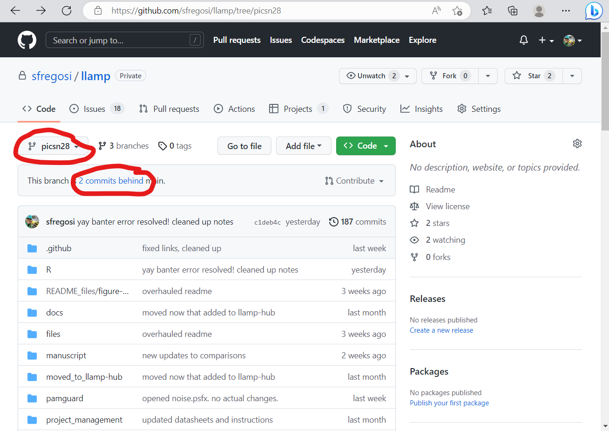
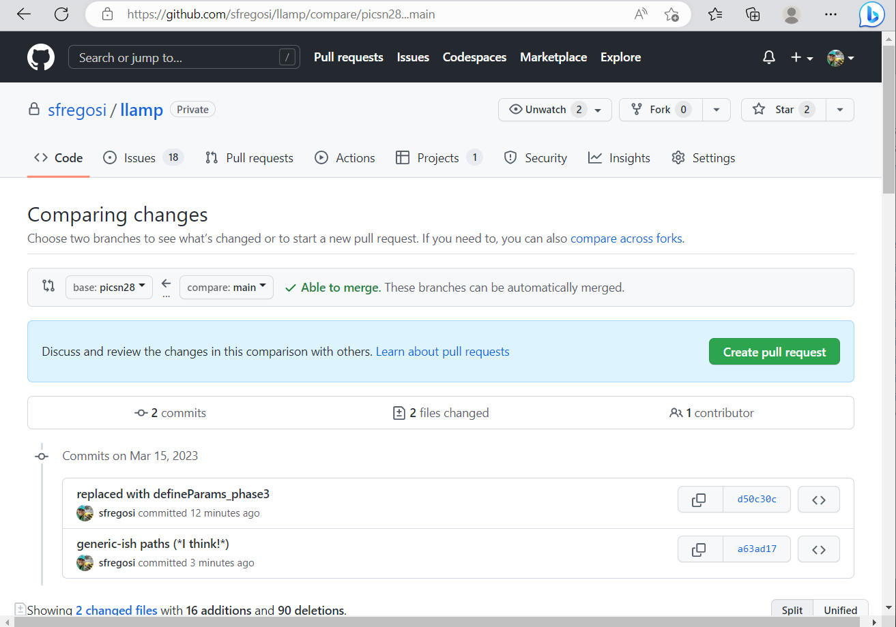

```{r setup, include=FALSE, message=FALSE, warning=FALSE,}
knitr::opts_chunk$set(echo = FALSE)
knitr::opts_chunk$set(fig.align = 'center')

library(fontawesome)
library(xaringanExtra)
library(htmltools)
```

```{r, xaringanExtra-clipboard, echo=FALSE}
htmltools::tagList(
  xaringanExtra::use_clipboard(
    button_text = "<i class=\"fa fa-clone fa-2x\" style=\"color: #301e64\"></i>",
    success_text = "<i class=\"fa fa-check fa-2x\" style=\"color: #90BE6D\"></i>",
    error_text = "<i class=\"fa fa-times fa-2x\" style=\"color: #F94144\"></i>"
  ),
  rmarkdown::html_dependency_font_awesome()
)
```

## Background

When working with a code repository that may receive regular updates, but that you need to modify locally to make minor changes (such as updating paths, etc) you can either **fork** the repository or create a **branch**. If you are not a collaborator with direct modification access to the repository, you will need to fork the repository. If you are considered a collaborator (by GitHub permissions) than you can create a branch. 

The best approach for this project (*I think*) is to create a new **branch** to have your own separate stream of edits for information like paths, folder structure, etc. This **'branch'** is an off-shoot of the original, which means you can pull in updates committed to the main branch of the repo but maintain your own edits. Additionally, you'll be able to make 'pull requests' to contribute any broad changes that would benefit the original (bug fixes, enhancements). But, with a branch, your changes won't automatically get updated for others and it will avoid conflicts of multiple people working within the code at once.

## Updating branch - only *behind* `main`

If the `main` branch has updates that you wish to encorporate into your branch, you will do this through the GitHub website. 

- Navigate to the repository of interest
- Select *your* branch from the drop down menu on the upper left
- GitHub will tell how many commits *ahead* and how many commits *behind* this branch is from the main branch
- If your branch is only commits behind the main branch, updating should be fairly straightforward

```{r ss-m1a, dpi = 80, fig.link = 'images/screenshot_merge_1_annotated.png', fig.cap = 'This screenshot shows the selected branch (not `main`, but in this case SFs personal branch, `picsn28`), and how it is 2 commits *behind* the main branch'}

```

- Click on the link with the number of commits behind (in the above screenshot, where it says '2 commits behind' in blue), to open the branch comparison page
- The compare page will note the specific commits that are different, and check if the two branches can be merged without any conflicts (e.g., edits on the same lines in the same files)

```{r ss-m2, dpi = 80, fig.link = 'images/screenshot_merge_2.png', fig.cap = 'The compare page spells out the exact changes, and checks the ability to merge'}

```

- If there are no merge conflicts, select the green *Create pull request* button
- Give the pull request a short description
- In the pull request pag, there is more detailed checks, a statement about conflicts, and space to include additional comments

```{r ss-m3a, dpi = 80, fig.link = 'images/screenshot_merge_3_annotated.png', fig.cap = 'This screenshot shows the pull request page, in a case with no merge conflicts'}
knitr::include_graphics('images/screenshot_merge_3_annotated.png')
```

- If there are no conflicts, you can select the green *Merge pull request* button and all commits from the `main` branch will be merged with the current, selected branch
- The branch that `main` was merged with will now say that it is '1 commit ahead of main' because of this merge commit


<sub>[Back to top](#)</sub>

## Updating branch - only ahead of `main`

## Updating branch - ahead and behind


## Last updated {.appendix}

`r fa(name = "calendar-check")` `r format(Sys.Date(), "%d %B %Y")`
