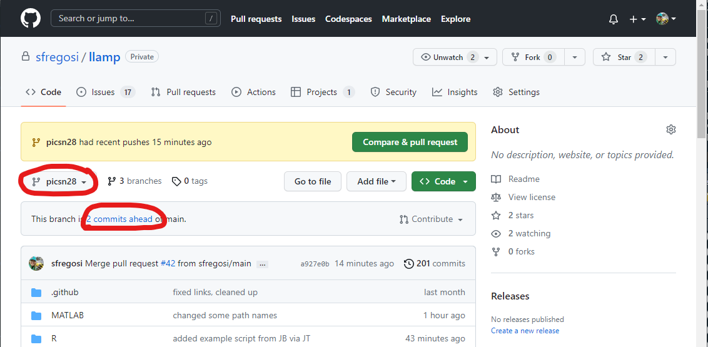
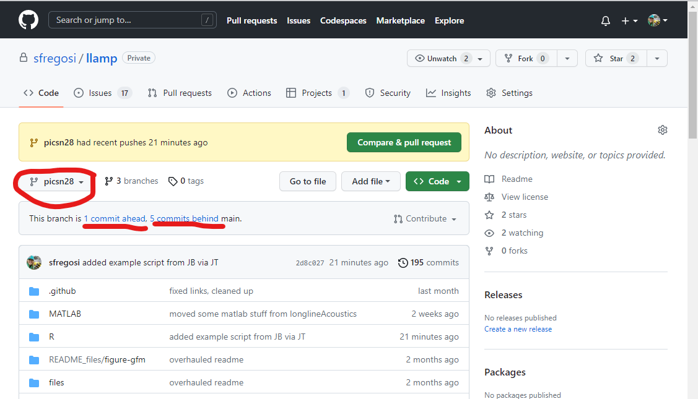
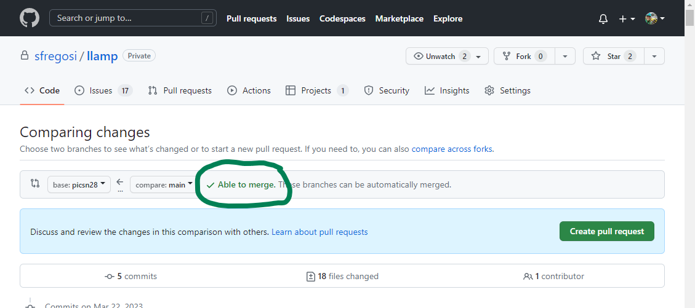
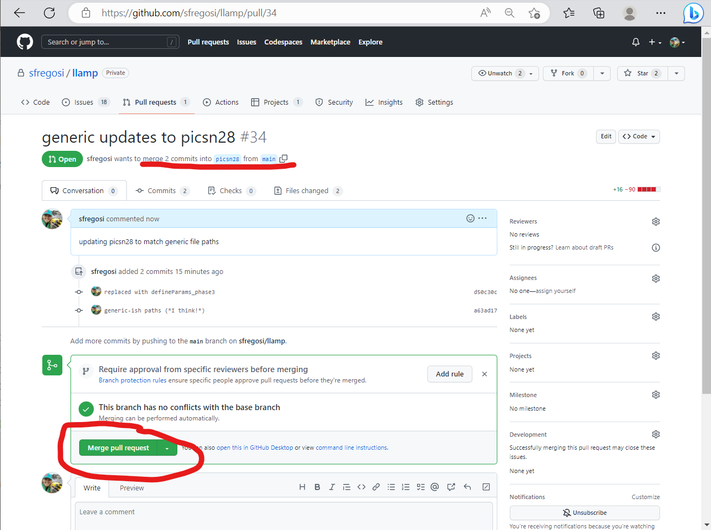

```{r setup, include=FALSE, message=FALSE, warning=FALSE,}
knitr::opts_chunk$set(echo = FALSE)
knitr::opts_chunk$set(fig.align = 'center')

library(fontawesome)
library(xaringanExtra)
library(htmltools)
```

```{r, xaringanExtra-clipboard, echo=FALSE}
htmltools::tagList(
  xaringanExtra::use_clipboard(
    button_text = "<i class=\"fa fa-clone fa-2x\" style=\"color: #301e64\"></i>",
    success_text = "<i class=\"fa fa-check fa-2x\" style=\"color: #90BE6D\"></i>",
    error_text = "<i class=\"fa fa-times fa-2x\" style=\"color: #F94144\"></i>"
  ),
  rmarkdown::html_dependency_font_awesome()
)
```


## Background

When working with a code repository that may receive regular updates, but that you need to modify locally to make minor changes (such as updating paths, etc) you can either **fork** the repository or create a **branch**. If you are not a collaborator with direct modification access to the repository, you will need to fork the repository. If you are considered a collaborator (by GitHub permissions) than you can create a branch. 

The best approach for this project (*I think*) is to create a new **branch** to have your own separate stream of edits for information like paths, folder structure, etc. This **'branch'** is an off-shoot of the original, which means you can pull in updates committed to the main branch of the repo but maintain your own edits. Additionally, you'll be able to make 'pull requests' to contribute any broad changes that would benefit the original (bug fixes, enhancements). But, with a branch, your changes won't automatically get updated for others and it will avoid conflicts of multiple people working within the code at once.

*Creating a branch is only possible if you are a collaborator in the repository; if not, you can 'fork' the repository and still stay up-to-date with changes as well as make pull-requests.*

This helper document provides suggested steps for cloning a GitHub repository, creating a new branch, and working with GitHub/GitHub Desktop. 

<sub>[Back to top](#)</sub>

## Clone a repository

**To clone a repository:**

- Open GitHub Desktop
- Select *File* > *Clone repository...*
- Select the *URL* tab and paste `https://github.com/sfregosi/llamp` into the empty URL space 
- Specify the location to save the repository on your local machine (suggest `documents\github\llamp`) and hit *Clone*
- This will copy all the `llamp` components to the specified folder 
- Select this repository within GitHub Desktop from the *Current repository* drop down repository list on the left side

<sub>[Back to top](#)</sub>

## Create a branch

**To create a new branch:**

- The default/primary branch is called `main`. In the *Current branch* drop down, select *New branch* and provide the branch a name (e.g., `fregosi` or `picsn28` - the name of your computer)
- This will create a new branch and and it's name should now appear in the *Current branch* section in GitHub Desktop 
- Whenever you want to switch between branches, you select it from this drop down in GitHub Desktop. But, once one branch is selected, it should remain the chosen branch through computer restarts, etc, but it is always good to double check if making major changes! 
- Finally, hit *Publish this branch* to push this branch to the 'remote' location of this repository on github.com. This will only need to be done once after creating a new branch

<sub>[Back to top](#)</sub>

## Commit, push, and pull changes

**Commit, push, and pull changes:**

- Whenever you make changes to code on your local machine, these changed files will appear in the left side panel of GitHub Desktop. After making a set of specific changes, you can create a *snapshot* of the files at that point in time (so you can go back if something bad happens, or others can easily track what was changed -- the purpose of version control!) by making a **'commit'** for these changes. Do so by typing a short message/description in the lower left and hitting *Commit*
- After committing changes, those changes have been saved on your local repository and branch, but ONLY locally. After making a commit, or several commits (e.g, at the end of the day), **'push'** these changes to the remote repository on Github.com using the *Push origin* button on the top right of GitHub Desktop
- The top-right will display different options depending on what changes are available
  - If there are local changes, it will display *Push origin*; it is good practice to push all commits at the end of each day or session working with a particular code set
  - If there are no local changes, it will say *Fetch origin*, which will check for new changes from the web
  - If there are changes present on the remote that are not yet local, it will say *Pull origin*
  - It is good practice to fetch and pull changes at the start of each day or session to avoid any conflicts of files being changed simultaneously in two locations. If you are working within your own branch, you will be the only one making changes so there won't really be unexpected changes to be pulled from the web. But, if you are working within the same branch as others, or with code that you are not modifying but others are regularly updating, this becomes more critical


<sub>[Back to top](#)</sub>

## Merge/update branches


### Compare branches

To check if the `main` branch has updates that you wish to incorporate into your branch, or if your branch has updates you'd like to incorporate into `main`, use the **GitHub website**. 

- Navigate to the repository of interest
- Select *your* branch from the drop down menu on the upper left
- GitHub will tell how many commits *ahead* and how many commits *behind* this branch is from the `main` branch
- Your branch can be just *behind* (Figure \@ref(fig:ss-mba)), just *ahead* (Figure \@ref(fig:ss-maa)), or *both ahead and behind* (Figure \@ref(fig:ss-maba)) the `main` branch

```{r ss-mba, dpi = 80, fig.link = 'images/screenshot_merge_behind_annotated.png', fig.cap = 'This screenshot shows the selected branch (not `main`, but in this case SFs personal branch, `picsn28`), and how it is 2 commits *behind* the main branch'}
knitr::include_graphics('images/screenshot_merge_behind_annotated.png')
```

```{r ss-maa, dpi = 80, fig.link = 'images/screenshot_merge_ahead_annotated.png', fig.cap = 'This screenshot shows the `picsn28` branch and how it is 2 commits *ahead* of the main branch'}

```

```{r ss-maba, dpi = 80, fig.link = 'images/screenshot_merge_ahead_behind_annotated.png', fig.cap = 'This screenshot shows the `picsn28` branch that has commits both ahead and behind `main`: 1 commit *ahead* and 5 commits *behind*'}

```

### Update your branch to match `main`

If your branch is any commits *behind* `main`, you may want to update your branch to match `main` without losing the changes you have made (e.g., to mapped paths, etc). This is the more likely situation in the approach of using branches outlined here. 

- Click on the blue link that says *## of commits behind* to open the detailed branch comparison page
- The comparing changes page will note the specific commits that are different in `main` from your branch and will check if the two branches can be merged without any conflicts (e.g., edits that are on the same lines of the same files that don't match) or if any conflicts need to be resolved first.

#### No merge conflicts

- If there are no merge conflicts, the comparing changes page will state *Able to merge* in green at the top (Figure \@ref(fig:ss-matm))
- Select the green *Merge pull request* button and a new page will open
  - Give the pull request a short description
  - In the pull request page there are more detailed checks, a statement about conflicts, and space to add any additional comments
- If there are no conflicts, select the green *Merge pull request button* and all commits from the `main` branch will be merged with the current, selected branch (Figure \@ref(fig:ss-mprda))
- The branch that `main` was merged with will now say that it is '1 commit ahead of main' because of this merge commit (or how ever many it was ahead before plus 1)
- Now, return to GitHub Desktop and *Fetch origin* for your branch. This will pull the newly merged changes from the remote (web) to your local branch

```{r ss-matm, dpi = 80, fig.link = 'images/screenshot_merge_able_to_merge.png', fig.cap = 'The comparing changes page spells out the exact changes in the commits where `main` is ahead, and checks the ability to merge. In this case, there are no conflicts and so the branches are able to be merged automatically.'}

```

```{r ss-mprda, dpi = 80, fig.link = 'images/screenshot_merge_pull_request_details_annotated.png', fig.cap = 'This screenshot shows the pull request page, in a case with no merge conflicts'}

```

#### With stashed changes

If you have uncommitted changes locally (meaning they appear in the left panel of GitHub Desktop), but merge `main` with your local branch on GitHub.com, when you go to *Pull* these merged changes, you may get an error about conflicts with your uncommitted changes (see Figure \@ref(fig:ss-me1)). 

GitHub Desktop offers to 'stash' your changes while it fetches the new remote changes, and then you can address any conflicts. To do this:

- Select *Stash changes and continue*. Your changes will still be saved, but the new remote files will update locally
- After the fetch is complete, re-open your stashed changes from the lower portion of the left hand panel
- Conflicts with the new remote change and your stashed changes will be identified in the file the same way as merge conflicts - with a series of `<<<<<< ======= and >>>>>>>` highlight the differences. 
- Open the file in the program it was written in (e.g., R or MATLAB) or a text editor and use the indicators to select the final version of various lines you want to keep
- Commit your changes and push to the remote! 

```{r ss-me1, dpi = 80, fig.link = 'images/screenshot_merge_error_1.png', fig.cap = 'Screenshot showing the error you may get if you merge a branch on the remote, but have uncommited changes locally.'}

```

#### With merge conflicts

- If there are merge conflicts, they must be resolved before the pull request can be merged
- GitHub will flag these conflicts directly in the files
- There are a few ways to resolve these conflicts
  - Command line - this is complicated and not recommended
  - Web editor - this is easier to use but it ends up creating another intermediate branch which can be a little confusing as well
  - Open the file with the conflicts directly in a text editor - this is a more manual approach but I think is the simplest
  
If you encounter an instance where there are merge conflicts, you can always reach out to SF to walk through it together!

SF will work on screenshots for this in the future...


<sub>[Back to top](#)</sub>

### Update `main` to match your branch

If your branch has any commits *ahead* of `main` that may be useful to other users of the code (e.g., bug fixes) you can also make a *Pull Request* to add your commits to `main`. This is less likely in the application of branches outlined here but may happen!

The approach is the same as above, but instead click on the blue link with the *## of commits ahead* to open the detailed branch comparison page, but in this case to bring commits from your branch to `main`. 

If there are [no merge conflicts](#no-merge-conflicts), the pull request can be created and merged automatically. If there are [merge conflicts present](#with-merge-conflicts), they must be resolved before the pull request can be completed. 

<sub>[Back to top](#)</sub>


## Last updated {.appendix}

`r fa(name = "calendar-check")` `r format(Sys.Date(), "%d %B %Y")`
