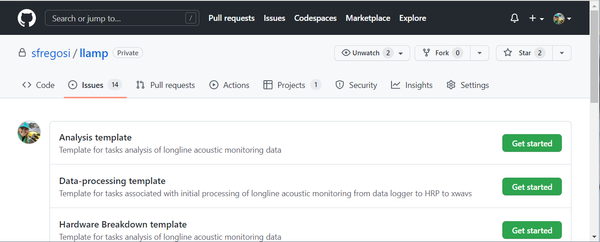
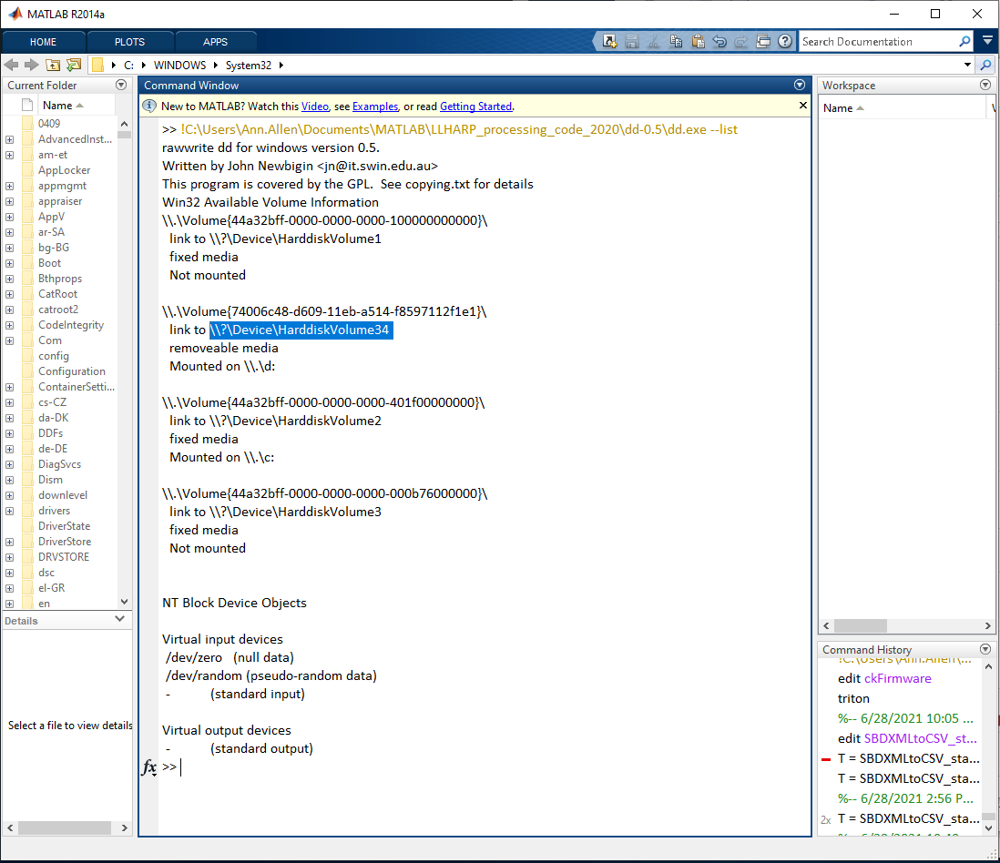
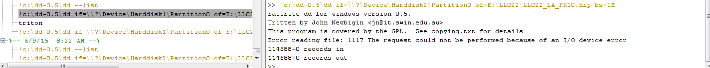
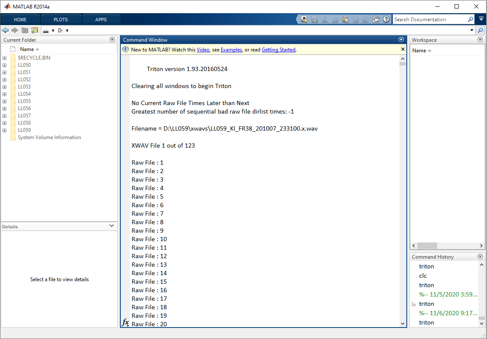

```{r setup, include=FALSE, message=FALSE, warning=FALSE,}
knitr::opts_chunk$set(echo = FALSE)
knitr::opts_chunk$set(fig.align = 'center')

library(fontawesome)
library(xaringanExtra)
library(htmltools)
```

```{r, xaringanExtra-clipboard, echo=FALSE}
htmltools::tagList(
  xaringanExtra::use_clipboard(
    button_text = "<i class=\"fa fa-clone fa-2x\" style=\"color: #301e64\"></i>",
    success_text = "<i class=\"fa fa-check fa-2x\" style=\"color: #90BE6D\"></i>",
    error_text = "<i class=\"fa fa-times fa-2x\" style=\"color: #F94144\"></i>"
  ),
  rmarkdown::html_dependency_font_awesome()
)
```

#### Create GitHub Issue

Create a new data processing issue for the latest trip, and add it to the [Longline Acoustic Monitoring GitHub Project](https://github.com/users/sfregosi/projects/3){target='_blank'}.

- Navigate to the [llamp](https://github.com/sfregosi/llamp){target='_blank'} repository's [New Issue](https://github.com/sfregosi/llamp/issues/new/choose){target='_blank'} page and press the green **Get Started** button for the **Data processing template**
- Update the issue name to match this trip number, add assignees, and add to the [Longline Acoustic Monitoring Project](https://github.com/users/sfregosi/projects/3){target='_blank'}

```{r ss-github, dpi = 80, fig.link='images/screenshot_github_analysis-template.png', fig.cap = 'Screenshot showing the new issue chooser with just the Post-processing template shown. Select the \'Data processing template\''}

```


<sub>[Back to top](#)</sub>

---

# Detailed data processing steps

## Update metadata

Fill in relevant deployment info on [LLHARP Data Summary](https://docs.google.com/spreadsheets/d/1S0e3T8GijoM0NTLCLjKV_9d3C9_YnHNqZhkV0BNJkzg/edit#gid=0)

Info to be filled out:

- Frame and Datalogger numbers, versions, settings, dates from the check sheets
- TDR number
- y/n for upload of datasheets
- Any set-up/off-load problems

<sub>[Back to top](#)</sub>

## Image HRP

Image Longline HARP Data (create .hrp file from SD card).  
*This is a several-hours long process, and should be completed locally on an external HD*
    
- Connect both the SD card, and the hard drive that you are copying the data to
  - The SD card will show up as an unformatted drive. **Do NOT format it** 
- Open MATLAB and run `dd.exe --list` as a command line command to list all of the attached disks
  - A copy of dd.exe can be found on Google Drive at [‘LLHARP MASTER/Data Management Docs/LLHARP_processing_code_2020/dd-0.5/'](https://drive.google.com/drive/u/0/folders/1dLdRXpqMR0RmNHrE9B8URkbu4bN6OPog)
  - Example: 
  ```
!C:\Users\Ann.Allen\Documents\MATLAB\SIOHARPData_processing_codes_20170403\dd-0.5\dd.exe --list
    ```
- Note the `HarddiskVolume#` for the SD card. If it is not obvious which one the SD card is, disconnect the card, re-run `--list`, and then reconnect and look for the newly added `Harddisk` and `Partition` 

```{r ss-partitions, dpi = 60, fig.link='images/screenshot_imaging-HRP_view-partitions.png', fig.cap = 'Screenshot showing output for listing the partitions'}

```

- Create .hrp file
  - Enter `if=`, `of=`, and `bs=` commands to start imaging, where 
    - The first path is the local path where you have dd.exe stored 
    - `if=` is the path of the SD card from the last step 
    - `of=` is the drive path for where you want to save the .hrp file and what you want to name it 
      - The .hrp file naming will follow the convention: *dataID_TwoLetterBoatAbbreviation_FourLetterFrameNumber_FourLetterDataLoggerNumber.hrp*
    - `bs=1M`
  - Example:
```
!C:\Users\Ann.Allen\Documents\MATLAB\SIOHARPData_processing_codes_20170403\dd\dd.exe if=\\?\Device\HarddiskVolume34 of=DRIVE:\LL008\LL008_KM_FR03_DL73.hrp bs=1M
```

  - This will create one large .hrp file that can then be converted into multiple separate xwav files in Triton (see below 'Process HRP tasks')
  - The .hrp file takes several hours to offload. There will not necessarily be any indication that the process is working besides a continual ‘Busy’ 
message in MATLAB and the size of the .hrp file being generated will not necessarily increase while the process is working
  - When processing is finished your screen should look similar to Figure \@ref(fig:ss-img-HRP) below

```{r ss-img-HRP, layout = 'l-body-outset', fig.link = 'images/screenshot_imaging-HRP_run-dd_cropped.png', fig.cap = 'Screenshot showing what the imaging process should look like after running the dd.exe'}

```

- Copy raw HRP data to server (`\\PICQUEENFISH\PSD2\CRP\LLHARP\LL0##\`); each HRP goes in the `HRP` folder within each of the `FR##_DL##` folders
<sub>[Back to top](#)</sub>

## Process HRP - 2020 processing code

- **Create Parameter File**
  - This is a .txt file with deployment information
  - The naming convention follows the .hrp file (e.g., 'LL0##_XX_FR##_DL##.txt' where XX is the two letter vessel abbreviation) but with '.txt' as the extension 
  - It is easiest to (a) copy the file from a previous deployment and rename according to same convention as the .hrp file or (b) copy the block of text below into a new blank text file, then update accordingly:  
    - Experiment Name (8 chars)       = Data ID based on trip # & vessel ID (ex. ‘LL001_KM’)
    - Site Name (4 characters)        = Frame number (ex. FR03)
    - Instrument ID (4 characters)    = Datalogger ID (ex. DL73)
    - Latitude, Longitude and Depth do not need to be added
  - Save the updated file to the same folder as the .hrp file
  
```{verbatim}
% LL0##_XX_FR##_DL##.prm
% paramfile for`OneReadMultiWrite.m input for generating xwavs from .hrp files
% experiment specific 

% Save this file to the hrp disk

PARAMS.xhd.ExperimentName = 'LL0##_XX'; % Data ID incl. project name and deploymentNumber - 8 chars, e.g., LL001_KM
PARAMS.xhd.SiteName = 'FR##';           % sitename - 4 chars. e.g., FR03
PARAMS.xhd.InstrumentID = 'DL##';       % harp instrument id (generally dataloggerNumber) - 4 chars, e.g., DL73
PARAMS.xhd.Longitude = -00000;	% in Degrees Minutes.mmm
PARAMS.xhd.Latitude = 0000;		% in Degrees Minutes.mmm
PARAMS.xhd.Depth = 000;		% meters down is positive

PARAMS.ltsa.ftype = 2;      % filetype 1 = WAVE, 2 = XWAV
PARAMS.ltsa.dtype = 1;      % datatype 1 = HARP, 2 = ARP, 3 = OBS, 4 = towed array or sonobuoy
PARAMS.ltsa.ch = 1;       % channel to do ltsa on for multichannel wav files
```  

- **MATLAB Setup**
  - Make sure that the folder ‘LLHARP_processing_code_2020’ is in a local directory and on the MATLAB path 
    - If you have any other Triton folder on your MATLAB path, make sure that *this folder* is higher in the directory
    - If there are new versions of the firmware on the LLHARP you will need to get a new version of ‘ckFirmware.m’ and ‘table_ckFirmware.csv’
    - Run Triton by typing `triton` in the MATLAB command window
    - If it is not already installed, add the ‘HRP’ Remora to Triton

- **Process the .hrp file**
  - Process using the HRP Remora
  - Remoras > HRP File > Convert HRP File to XWAV files
  - Select '.hrp file'
  - Select the parameter file that you created (It has a .txt extension so you will need to select ‘view all files’ in the GUI)
  - Select the output folder for the XWAVs
  - If there are no errors the MATLAB output will look like:  

```{r ss-process-HRP, dpi = 80, fig.link = 'images/screenshot_process-HRP-to-xwavs.png', fig.cap = 'Screenshot showing output as it should be if there are no errors while processing the HRP to xwavs'}

```

- **Make the LTSA**
  - Within Triton select ‘Tools > Make LTSA from Directory of Files’
    - Enter file type: 2 (XWAV)
    - Select directory with XWAV files
    - Set Long-term spectrogram parameters:
      - time average length (seconds): 5
      - Frequency bin size (Hz): 100
    - LTSA should be named to include the trip ID, instrument ID and LTSA info
      - Example: ‘LL008_FR04_5s_100Hz.ltsa’  
  - This process will take several hours

<sub>[Back to top](#)</sub>

## Process HRP - 2022 processing code

#### Background details
Starting with LL065, SF trying to process the LLHARP with the latest processing code from SIO. SF initially received this version via email from A. Allen/E O'Neill and it was placed in a private GitHub repo [harp-processing-sio-2022](https://github.com/sfregosi/harp-processing-sio-2022). The 2020 processing code originally was on Google Drive (still there [here](https://drive.google.com/drive/u/0/folders/101LmedejW1OS6TqVblHbRQVRed-JOvmO)) but SF also made that into a GitHub repository in case any changes have to be made to it, so it is now under version control: [longline-processing-2020](https://github.com/sfregosi/longline-processing-2020)

### Set up the processing machine

Depending on where the processing is happening, different machines may have different saved MATLAB paths that point to different versions of Triton which can lead to issues. Start by properly setting up the correct MATLAB paths. 

- First, set Matlab path to the default
  - Go to *Set Path* in top ribbon menus (in the *HOME* tab)
  - Select *Default*, and say *Yes* when prompted to confirm
  - Press *Save* to save the settings and then *Close* to exit the Set Path window
- Second, set Matlab path to the harp-processing-2022 repository
  - Go to *Set Path* in top ribbon menu (in the *HOME* tab)
  - Select *Add with Subfolders...* and navigate to the correct local copy of the repository on this machine and press *Select Folder*
    - On the virtual machine PICV023, this location is `\\PICKINGFISH\USERS\selene.fregosi\CodeForVMs\harp-processing-sio-2022`
  - A bunch of paths will now be listed at the top of the list, highlighted in blue
  - Press *Save* and *Close* to set the path
  
After setting the paths, run Triton and add the HRP Remora
- Run Triton by typing `triton` in the MATLAB Command Window
  - The text that populates the Command Window should say the below version information if the correct path/Triton version are set:
  
```
   
         Triton version 1.94.20220401
 
Clearing all windows to begin Triton
```
 
 - The three Triton windows will open and the correct version (1.94.20220401) should also be displayed in the *Plot - Triton* window with the logo
- If this is the first time processing has been run on this machine, the **HRPproc Remora** will have to be added 
  - In the *Control- Triton* window, select *Remoras* > *Add Remora* 
  - Navigate to the 'triton.194.20220401/Remoras' folder, highlight the 'HARPproc_220401' folder, and 'Select Folder'
  **_NB: I do not know what the difference between 'HARPproc_220401' and 'HARPproc_220401_X2' is_**
  - Select 'Yes' when prompted to restart Triton
  - If the Remora was properly added, then it will now be visible in the *Remoras* drop down menu in the *Control - Triton* window
  
### HRPproc menu options

#### HRP File Tools
**Disk Header:** Provides disk header information for a select HRP file and prints it into the *Message - Triton* folder. Example output:

```
filetype 1: USB file
 
Sector 0: 
Disk Type = HARP
Disk Number = 2
 
Sector 2: 
First Directory Location [Sectors] = 8
Current Directory Location [Sectors] = 226
 
First File Location [Sectors] = 539
Next File Location [Sectors] = 104816111
 
Max Number of Files = 8326
Next File = 3491
 
Sample rate = 200000
Disk Number = 2
Firmware Version = V2.34
Description = No Decsription entered
Disk Size [Sectors] = 249737216
```

**Directory List**: Lists all raw files ona selected HRP. List is printed directly into the *MATLAB Command Window* and contains 12 columns. The columns are: raw file number, ??, 2 digit year, month, day, hour, min, sec, millisecond, sample rate, ??, ??, ??. 

Example output: 
```

   1        539         22          8         27          0          8         11        520     200000      30000   15360000          0
   2      30539         22          8         27          0          8          4        600     200000      30000   15360000          0
   3      60539         22          8         27          0          7         57        680     200000      30000   15360000          0
   4      90539         22          8         27          0          7         50        760     200000      30000   15360000          0
   5     120539         22          8         27          0          7         43        840     200000      30000   15360000          0
   6     150539         22          8         27          0          8         58        840     200000      30000   15360000          0

...

3486  104631743         22          9          4         13         24         16          0     200000      30000   15360000          0
3487  104661743         22          9          4         13         25         31          0     200000      30000   15360000          0
3488  104691743         22          9          4         13         26         46          0     200000      30115   15418880          0
3489  104721858         22          9          4         13         28          1          0     200000      30004   15362048          0
3490  104751862         22          9          4         13         29         16          0     200000      30240   15482880          0
3491  104782102         22          9          4         13         30         31          0     200000      34009   17412608          0

```

#### Processing Tools

**HRP to XWAV**: Select this menu option to convert a single HRP to its individual xwavs. 

- Will open new window and prompt to 'Load HRP Processing Parameters'. Previously this information was read in from a text file but in this case it will load a previously created/saved .mat file. 
- For the first time processing a HRP, select *No*
  - [ ] From what I can tell in the code, *Yes* would allow you to load a previously created/saved .mat file, but see below, *Save* doesn't seem to work
  - *Yes; resume processing* doesn't look like it loads any parameters, so must just use what is currently loaded/set
- New GUI window will open. Set decimation factor (DF) to 1 and hit *OK*
- Next window prompts to *Browse* for xwav output folder. save within the folder for each FR##_DL## for this trip. After selecting folder, hit *Continue*
- New window allows additional options to be selected. **_Not sure what these do yet..._**
  - *Save params* button throws an error in `hrp2xwav_paramC.m` 
    - [ ] *THINK* this is fixed with [this commit](https://github.com/sfregosi/harp-processing-sio-2022/commit/316cf92a653c831ca346e235e50bf39054b9752a) 
  - *Continue* does work
- Select the HRP to be processed in the next pop up window
- Either load or specify the trip details in the next GUI
  - To just load a .txt hdr file as built above, just type `Y` in first entry and hit *OK* and you will be prompted to select the appropriate file
  - Otherwise, specify the values in each entry line and hit *OK*
  - If any inputs are the wrong size or format, a warning box will appear and you will be able to re-enter or re-select the appropriate .txt file
- It will then prompt to again save the parameters and suggest a particular folder within the data folder
  - [ ] In the future, might make sense to save an earlier version of the more simple parameters in a higher level folder (e.g., the decimation factor, etc) and call that for LLHARPs in general, than save specific ones for each trip and frame that has the full paths mapped. Need to look into this more
  
  

**XWAV to LTSA**:

#### HRP Debug Tools

These are all 'greyed' out 

**Check Directory List Times**

**Plot Sector Times**

**Fix Directory List Times**

<sub>[Back to top](#)</sub>

## Upload data

-   put copy of HRP and xwavs on server
-   save copy of HRP on physical drive (and note this somewhere...)
-   put in-air recordings on server

<sub>[Back to top](#)</sub>

---

# Previous/existing documentation

[LLHARP Part II - Data Processing](https://docs.google.com/document/d/1po1G2isgSCfYWc1dj8XphotPeZuOZ22ugL5wsc9o3JY/edit)
Google Doc *9 August 2022*


<sub>[Back to top](#)</sub>


## Last Updated {.appendix}

`r fa(name = "calendar-check")` `r format(Sys.Date(), "%d %B %Y")`


