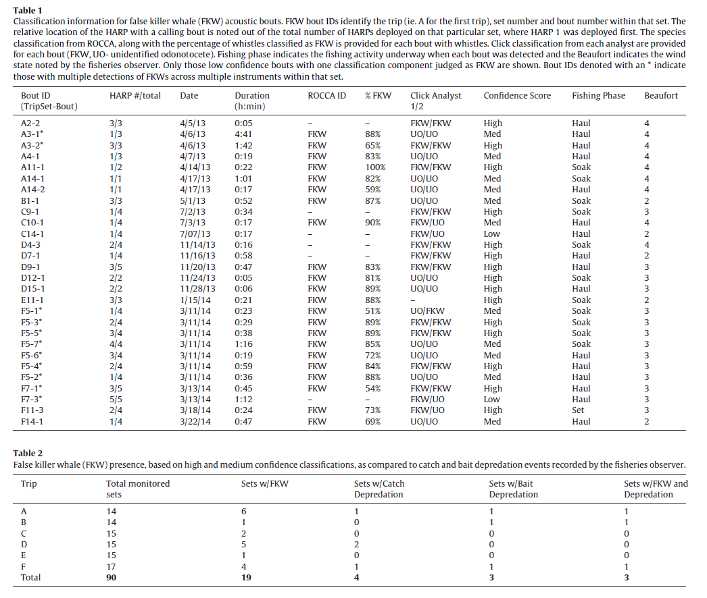

```{r setup, include=FALSE, message=FALSE, warning=FALSE,}
knitr::opts_chunk$set(echo = FALSE)
knitr::opts_chunk$set(fig.align = 'center')

library(fontawesome)
library(xaringanExtra)
library(htmltools)
```


### Summary docs quick links

[LLHARP Data Summary](https://docs.google.com/spreadsheets/d/1S0e3T8GijoM0NTLCLjKV_9d3C9_YnHNqZhkV0BNJkzg/edit#gid=0) Google Sheet


## Phase I 
#### Charters with multiple recorders

This initial phase of the project developed the recorder technology and worked with a chartered fishing vessel to fine-tune the equipment and monitor several fishing trips with up to five recorders on each fishing set. 

Major outcome:  
[Bayless et al. 2017](static/Bayless et al_2017_FisheriesResearch_Acoustically monitoring the Hawaii longline fishery for interactions with false killer whales.pdf) which quantifies how often, and during what part of the fishing set interactions happen. 

```{r BaylessTables, fig.cap="Tables 1 and 2 from Bayless et al. 2017"}

```

<sub>[Back to top](#)</sub>

## Phase II
#### Single recorders

Following several initial chartered trips, we worked with volunteer fishing vessels to take out a single recorder on trips in which those vessels had observer coverage. Through this phase we had a total of 59 fishing trips with recorders deployed.

A manuscript is currently in prep by Simonis et al. that expands on Bayless et al. 2017 and includes results from these single-recorder trips as well as the charter trips. It provides an automated detection and classification system for identifying false killer whales from LLHARP recordings and describes a particular noise of interest that is correlated with increased false killer whale detections in detail. 

<!-- Part of this manuscript prep includes a comparison of results from Bayless et al. 2017 vs what is presented in this manuscript. Notes and results can be found in the 2022 Manuscript Pages: -->

<!-- - [Bayless Simonis Comparison](/site/bayless_simonis_comp.html) -->

<!-- - [Simonis Data File Guide](/site/simonis_data_guide.html) -->

<sub>[Back to top](#)</sub>

## Phase III - Multiple Recorders

`r fa(name = "person-digging")` More to come here! 

This most recent phase of the project was launched in early 2021 and renewed efforts to deploy multiple recorders across the gear within a single fishing set. We continue to work with volunteer vessels to take out up to four recorders on trips where they have observer coverage. We are working to better understand what exactly is generating the specific noise of interest identified in Phase II, and potential mitigation methods. This effort includes two new aspects: (1) working with collaborators at Scripps Institution of Oceanography to model sound propagation around these fishing vessels and (2) taking in-air sound samples of two pieces of equipment on each vessel during different periods in the haul to see if we can pinpoint the source of noise. 


<sub>[Back to top](#)</sub>


## Last Updated {.appendix}

`r fa(name = "calendar-check")` `r format(Sys.Date(), "%d %B %Y")`

