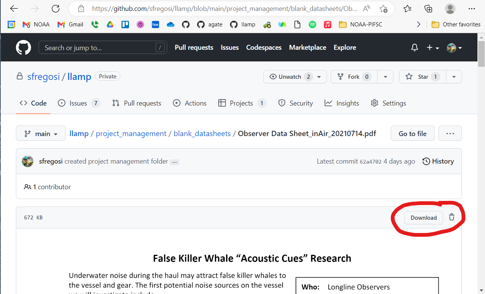

```{r setup, include=FALSE, message=FALSE, warning=FALSE,}
knitr::opts_chunk$set(echo = FALSE)
knitr::opts_chunk$set(fig.align = 'center')

library(fontawesome)
library(xaringanExtra)
library(htmltools)
```

```{r, xaringanExtra-clipboard, echo=FALSE}
htmltools::tagList(
  xaringanExtra::use_clipboard(
    button_text = "<i class=\"fa fa-clone fa-2x\" style=\"color: #301e64\"></i>",
    success_text = "<i class=\"fa fa-check fa-2x\" style=\"color: #90BE6D\"></i>",
    error_text = "<i class=\"fa fa-times fa-2x\" style=\"color: #F94144\"></i>"
  ),
  rmarkdown::html_dependency_font_awesome()
)
```

# Background
Vessel facilitation is a key component in ensuring the Longline Acoustic Monitoring Project is successful. We rely on volunteer vessels to take our equipment out with them and record a small amount of relevant metadata. 

When one of these volunteer vessels is assigned a fisheries observer (by the random lottery system), then we would like to send our acoustic equipment out with them. We prefer to send gear when an observer is on board because the observer collects additional data on the catch and marine mammal depredation that may be useful for our analyses. 

Additionally, our gear team needs at least 48 hours to prepare the acoustic gear for deployment. This process includes programming, testing, and installing new batteries, and can be completed in a day if all three people capable of doing this are available. We are not able to do this weeks in advance because as soon as the gear is in "standby" mode, there is significant power draw on the batteries. The more planning time we have, the better chance of getting a successful trip out the door. 

Vessel facilitation includes:  
**outreach** - connecting with vessels and getting them on board to participate in the project  
**coordination** - communication with a vessel when it is selected for an observer to confirm participation and arrange a time for gear hand off and pick up  
**equipment transfer** - delivery our acoustic gear from Ford Island to the vessel at the docks, and return of equipment after a trip  
**instruction** - a meeting with the captain, crew, and observer to hand off blank datasheets and go over what is expected of them to collect good data  
**debrief** - picking up filled out datasheets and collecting any feedback from the crew and observer about successes or failures during the trip that we can improve on, and delivering the report of our findings to the vessel

<sub>[Back to top](#)</sub>


# Trip initiation protocol  
This is the basic "order of operations" necessary to make a trip happen. Points of communication are in ***bold italics*** and specific personnel are **bold**.

**STEP 1** - Check equipment availability.  
At the start of each week, **S** check in with **E** (and/or our others in CRP who can prep gear if E is out) via ***phone or GChat or email*** to get their availability for prepping the acoustic gear that week. 

**STEP 2** - Get a vessel.  
**S** lets J at the Observer Program know we are a "go" for the coming week. The Observer Program has our list of confirmed vessels and will check any vessels that get assigned an observer against that list. If one of our vessels is assigned an experienced observer, J will ***email*** **S** with information on the vessel, observer, when the vessel plans to depart, and will cc the port coordinator for the week.

**STEP 3** - Confirm equipment prep/delivery is possible.  
**S** informs **E** and **N** via ***phone or GChat*** that one of our vessels is planning to depart and confirms that the planned departure date and time is workable for all. **N** ***calls*** the captain or owner to confirm they are willing to participate. **N** updates **S** via ***phone*** that the vessel is on board. **S** then confirms with **E** (and/or prep team) via ***phone or Gchat*** that the deployment is a GO and gets an estimate of when the gear will be ready by. 

**STEP 4** - Coordinate equipment delivery.
**S** lets J and the port coordinator know ***via email or phone*** that we are all set to send gear with this vessel and gets the final observer placement time. Depending on the flexibility of the departure time, **S** may connect the port coordinator and **N** so they can compare schedules and set up an observer placement time that works for the vessel and our research team. 

**STEP 5** - Prep equipment.  
**E** and team [prep the recorders](./hardware.html). Team ***texts*** **S** and **N** know the gear is ready and can be picked up from Ford Island. For the first trip with **N** picking up gear, **E** will meet him for the handoff and answer any questions about the actual recorders during the handoff. **N** ***texts*** **S** to confirm that gear has been picked up. 

**STEP 6** - Equipment delivery to vessel.  
**N** delivers gear to vessel and goes over the instruction and datasheets with the crew, captain, and observer all at once. If any questions come up during the deliver, **N** ***calls*** **S** to answer any questions. **N** ***texts*** **S** when gear has been successfully delivered! 

`r fa(name = "ship")` Vessel departs and fishes `r fa(name = "fish-fins")` and records sounds `r fa(name = "ear-listen")`

**STEP 7** - Equipment pickup from vessel and return to lab.
The observer will contact **N** when the vessel returns to port. **N** arranges a time to pick up the equipment and datasheets from the vessel, either from the observer or from the crew. **N** informs **S** via ***email or phone*** that the vessel is back in port and when the gear will be picked up from the vessel and dropped off at Ford Island. **S** tells **E** via ***Gchat or email or phone*** when the gear will be back at the lab. **E** tells **S** via ***Gchat or email or phone*** when the gear is in the lab and when the planned data offload will begin.  

<sub>[Back to top](#)</sub>


# Datasheets and instructions for vessels

Copies of all of current versions for the below documents can also be found in the [Blank Data Sheets and Flyers_migratedToGitHub](https://drive.google.com/drive/u/0/folders/1fhuhiTOhpeYihwKxJMC3BquGO26X2ki3) folder on Google Drive 

## Instructional documents

For our current Phase 3 of this project, with multiple recorders and in-air recordings, the instruction document is:

`r fa(name = "book")` [InstructionsForVesselAndObserver.pdf](https://github.com/sfregosi/llamp/blob/main/project_management/vessel_instructions/InstructionsForVesselAndObserver_MultipleRecorders.pdf)

Drafts and old instruction documents for single-recorder trips can be found in [instructions for vessels](https://github.com/sfregosi/llamp/tree/main/project_management/vessel_instructions) GitHub folder

## Datasheets
GitHub folder with [all blank datasheets](https://github.com/sfregosi/llamp/tree/main/project_management/blank_datasheets)

**Datasheets for underwater recorders.** A new datasheet is needed for each set, and up to 8 sets are monitored per trip, so at least 8 datasheets should be provided for each trip. We are currently running ***Multiple Recoder Trips***.

`r fa(name = "clipboard-list")` [Observer Datasheet - Multiple Recorder Trip](https://github.com/sfregosi/llamp/blob/main/project_management/blank_datasheets/ObserverDatasheet_MultipleRecorders.pdf)  
`r fa(name = "clipboard-list")` [Observer Datasheet - Single Recorder Trip](https://github.com/sfregosi/llamp/blob/main/project_management/blank_datasheets/ObserverDatasheet_SingleRecorder.pdf)  

**Datasheet for in-air recorders.** One datasheet is needed per trip; one datasheet has room for data for up to 8 sets. The datasheet also includes detailed recorder operation instructions.

`r fa(name = "clipboard-list")` [Observer Datasheet - In Air Recorders](https://github.com/sfregosi/llamp/blob/main/project_management/blank_datasheets/ObserverDatasheet_InAirRecorders.pdf)

## How to download

- Follow the above link to the datasheet of interest. If you access the folder of all datasheets, just click on the datasheet you want to download to be taken to it's individual page 
- Click the "Download" button on the upper-middle/right of the page



<sub>[Back to top](#)</sub>


# Fliers and outreach materials

We have a few informal outreach materials:   
An informational flier that can be distributed to potential interested vessels. There is an English and Vietnamese version.  
A PDF of two Powerpoint slides providing a general description of the project and the sound of interest.   
These can be found in the [fliers_outreach](https://github.com/sfregosi/llamp/tree/main/project_management/fliers_outreach) GitHub Folder

<sub>[Back to top](#)</sub>


# Vessel list

[Confirmed Vessel List](https://docs.google.com/spreadsheets/d/1i1eNu9zobr14yhx8RAXGHmk0pTh6a7s-/edit?rtpof=true#gid=1725502758)  
*Access to this document is restricted to just those within the project since it contains contact information for certain vessel captains and owners as well as trip timing information*

<sub>[Back to top](#)</sub>


## Last Updated {.appendix}

`r fa(name = "calendar-check")` `r format(Sys.Date(), "%d %B %Y")`
